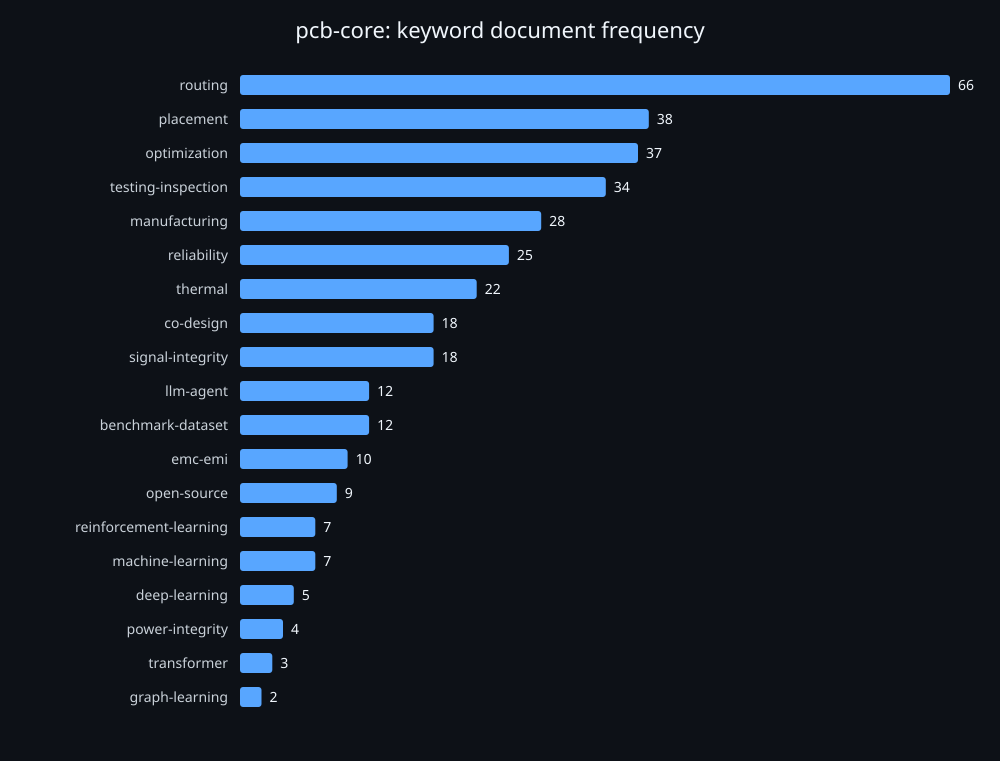
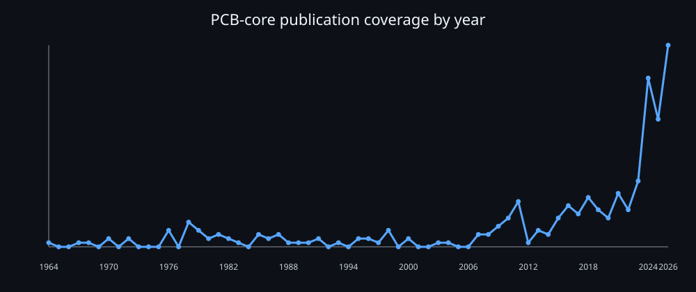
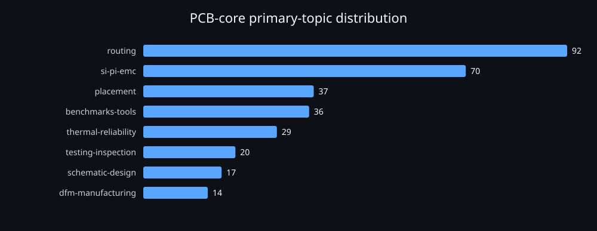

# Awesome PCB Design Papers

> A source-checked, evidence-card catalog for PCB design automation and transferable EDA research.

**Cutoff date:** 2026-09-08 · **PCB core:** 315 papers · **Related EDA:** 16 papers · **Topics:** 8

The repository follows the familiar Awesome-list layout. Each paper also has fields for code status, datasets or data sources, application scenario, problem addressed, final evaluation, baselines, and the evidence boundary.

## Scope

- **PCB core:** PCB, PWB, or PCBA is the object of design, placement, routing, SI/PI/EMC, reliability, DFX, or testing.
- **Related EDA references:** Transferable methods for chips, packages, chiplets, and LLM or agentic EDA are counted separately and are not presented as PCB papers.
- **Excluded:** Application papers that use a PCB only as an experimental carrier, electronic-waste or pollution studies, patents, book chapters, errata, and repeated model variants without an independent task or data contribution.

## Start here

Begin with the [open code and data view](docs/open-artifacts.md), then [browse by topic](#browse-by-topic), [inspect top-venue coverage](#operational-top-venue-coverage), or [read the evidence and status semantics](#evidence-and-status-semantics).

## First use

Open the [machine-readable catalog](data/papers.json) to read or compare records without installing any linked project. Each record keeps its primary paper URL, scope, topics, code/data status, application scenario, problem, evaluation, baselines, evidence level, and verification date.

Run this from the repository root; the read-only command counts current PCB-core records whose primary topic is routing (observed locally on 2026-09-12):

```console
$ python3 -c 'import json; p=json.load(open("data/papers.json")); print(sum(x["scope"] == "pcb-core" and x["primary_topic"] == "routing" for x in p["papers"]))'
92
```

To inspect a linked implementation or dataset, use the [open code and data view](docs/open-artifacts.md) and follow only entries whose status and URL are marked as verified.

## Browse by topic

| Topic | Primary papers | All tagged papers |
|---|---:|---:|
| [Placement and legalization](docs/topics/placement.md) | 37 | 45 |
| [Routing and constraint handling](docs/topics/routing.md) | 92 | 109 |
| [Schematic and design-chain automation](docs/topics/schematic-design.md) | 17 | 23 |
| [SI, PI, and EMC](docs/topics/si-pi-emc.md) | 70 | 93 |
| [Thermal and reliability co-design](docs/topics/thermal-reliability.md) | 29 | 46 |
| [DFM and assembly optimization](docs/topics/dfm-manufacturing.md) | 14 | 45 |
| [Testing and inspection](docs/topics/testing-inspection.md) | 20 | 51 |
| [Benchmarks, datasets, and tools](docs/topics/benchmarks-tools.md) | 36 | 116 |
| [Related EDA references](docs/related-eda.md) | 16 | 16 |

## Selected recent PCB-core papers (2024-2026)

The complete 2024-2026 PCB-core corpus contains 131 papers. This selected view applies the rule: from 2024 onward, up to two per primary topic, ranked by year, top-venue, evidence depth, and reusable artifacts.

| Year | Paper | Primary topic | Code | Data | Evidence |
|---:|---|---|---|---|---|
| 2026 | [ModuPlace: LLM-Assisted Modular PCB Placement via Preference-Optimized Constraint Graph Generation](https://dl.acm.org/doi/10.1145/3770743.3803892) | Placement and legalization | not found | reported | full-text |
| 2026 | [PCB-Migrator: Automated PCB PnR Migration](https://doi.org/10.23919/date69613.2026.11539307) | Schematic and design-chain automation | not found | not reported | abstract |
| 2026 | [Smart-PCLib: A LLM-based Multi-Agent Framework for Automated PCB Component Library Generation](https://doi.org/10.23919/date69613.2026.11539310) | Schematic and design-chain automation | not found | reported in abstract | abstract |
| 2026 | [DRLPlace: A Deep Reinforcement Learning-based Irregular and High-Density Printed Circuit Board Placement Method](https://doi.org/10.1109/asp-dac66049.2026.11420655) | Placement and legalization | not reported | not reported | metadata-only |
| 2026 | [Introduction to High-Speed LVDS Twisted Pair Transmission Across PCB and Chiplet RDL Interfaces](https://doi.org/10.1109/ectc51846.2026.00359) | SI, PI, and EMC | not reported | not reported | metadata-only |
| 2026 | [Warpage Prediction of PCB in Multi-Laminating Processes Considering Cure Shrinkage and Anisotropic Visco-Elastic Properties of Prepreg Core](https://doi.org/10.1109/ectc51846.2026.00258) | Thermal and reliability co-design | not reported | not reported | metadata-only |
| 2026 | [A Graph-based Benchmark Dataset for Printed Circuit Netlist Partitioning](https://doi.org/10.1038/s41597-026-06818-y) | Benchmarks, datasets, and tools | [open](https://doi.org/10.6084/m9.figshare.30020125.v2) | [open](https://doi.org/10.6084/m9.figshare.30020125.v2) | project-page |
| 2026 | [PCB-Bench: Benchmarking LLMs for Printed Circuit Board Placement and Routing](https://openreview.net/forum?id=Q5QLu7XTWx) | Benchmarks, datasets, and tools | [open](https://github.com/digailab/PCB-Bench) | [open](https://github.com/digailab/PCB-Bench) | project-page |
| 2026 | [Automation of PCB Autorouting via World-Model Reinforcement Learning and FreeRouting Integration](https://doi.org/10.1016/j.eswa.2026.131424) | Routing and constraint handling | [open](https://github.com/yinqimakeitfun/dreamer-Autorouting/tree/main) | reported | project-page |
| 2026 | [Complete Flow for PCB Design Consideration and Power/Signal Integrity Analysis Based on Broadband Model of Parasitic Elements](https://doi.org/10.1002/cta.70260) | SI, PI, and EMC | not found | measurement testbench | full-text |
| 2026 | [Thermal Analysis of Component Placement in High-Power Electronics and LED Boards](https://doi.org/10.1016/j.pedc.2026.100148) | Thermal and reliability co-design | not found | simulation cases | full-text |
| 2026 | [A Lightweight Model for PCB Surface Defect Detection](https://doi.org/10.3390/electronics15163500) | Testing and inspection | not found | reported in abstract | abstract |
| 2026 | [A multi-cognitive PCB defect detection model integrating Mamba](https://doi.org/10.1038/s41598-026-49734-2) | Testing and inspection | not found | reported in abstract | abstract |
| 2026 | [A-star Algorithm-Based Automated Routing for Multilayer PCB](https://doi.org/10.1109/apec51134.2026.11516836) | Routing and constraint handling | not found | not reported | abstract |
| 2026 | [AI-Driven PCB Assembly Defect Detection Using Hybrid Deep Learning Architectures](https://doi.org/10.5220/0013856700004052) | DFM and assembly optimization | not found | reported in abstract | abstract |
| 2026 | [Intelligent Disassembly System for PCB Components Integrating Multimodal Large Language Model and Multi-Agent Framework](https://doi.org/10.3390/pr14020227) | DFM and assembly optimization | not found | not reported | abstract |

## Operational top-venue coverage

In this repository, complete top-venue coverage means a closed, auditable set: **DAC, ICCAD, DATE, ASP-DAC, ISPD, ECTC, EPEPS**. This is an operational definition, not a judgment about conference rankings. Each of the 193 admitted DOIs is bound to a catalog row. The inventory aims to account for every matching paper in that set, but inaccessible or rate-limited proceedings prevent a mathematical completeness claim. Related EDA is included only as a representative reference set.

| Venue | Included | Metadata-only | Evidence-enriched |
|---|---:|---:|---:|
| DAC | 64 | 57 | 7 |
| ICCAD | 7 | 7 | 0 |
| DATE | 7 | 3 | 4 |
| ASP-DAC | 11 | 9 | 2 |
| ISPD | 5 | 2 | 3 |
| ECTC | 46 | 46 | 0 |
| EPEPS | 53 | 51 | 2 |

## Keyword and trend analysis

Keyword counts use a controlled regular-expression vocabulary over every title. Scenario and problem summaries are included only for records supported by an abstract, full text, or project page. **Document frequency** counts a keyword at most once per paper. PCB core and Related EDA are analyzed separately.







Top controlled keywords: `routing` (66), `placement` (38), `optimization` (37), `testing-inspection` (34), `manufacturing` (28), `reliability` (25), `thermal` (22), `co-design` (18), `signal-integrity` (18), `llm-agent` (12), `benchmark-dataset` (12), `emc-emi` (10).

## Data source and refresh

Canonical source: [data/papers.json](data/papers.json). README, topic pages, and the open-artifacts view are generated by [`scripts/render_catalog.py`](scripts/render_catalog.py). Update the catalog source first, then run:

```console
python3 scripts/validate_catalog.py data/papers.json --require-audit
python3 scripts/analyze_catalog.py
python3 scripts/render_catalog.py
```

## Evidence and status semantics

- `open` means a code/data URL resolved during verification; `announced_or_mentioned_unverified` is not counted as released.
- `not_found` means no repository was found in the inspected paper/project sources; it does **not** prove that code does not exist.
- `not_reported_in_accessible_source` means the accessible metadata/abstract/full text did not state the field.
- `reported_link_unreachable` means the paper names an artifact URL, but the cutoff-date link check could not retrieve it.
- `metadata-only`, `abstract`, `full-text`, and `project-page` expose how deep the extraction went.

See [methodology](docs/methodology.md), [GLM/DeepSeek consultation notes](docs/consultation-notes.md), [top-venue audit](data/top_venue_audit.json), [machine-readable catalog](data/papers.json), [trend outputs](analysis/summary.json), and the [URL-check snapshot](analysis/link_check.json).

## Coverage boundary

This is a structured, cutoff-dated catalog: it is not a claim of absolute global exhaustiveness. Publisher indexing delays, title changes, inaccessible proceedings, and papers that never use board-specific terms can still create gaps. Please open an issue or PR with a primary source and the required evidence fields.

## Contributing

See [CONTRIBUTING.md](CONTRIBUTING.md). Add or correct records in [data/papers.json](data/papers.json) with a DOI/publisher/arXiv primary link, scope/topics, explicit code/data/scenario/problem/evaluation/baseline statuses, and source/locator/check date. Run the validation, analysis, and render commands above; generated pages should change only as a consequence of the source edit.
